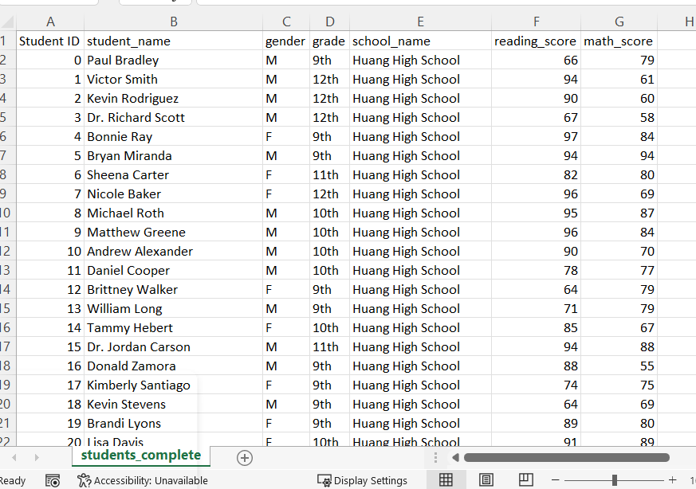

# School_District_Analysis

## Challenge Overview
### Overview of the School District Analysis
The purpose of the original analysis was to analyze test scores in math and reading for schools in a school district, and then to summarize those test scores based on a variety of school metrics (i.e., what affect does the type of school/size of school/budget for school spending have on test scores). The analysis was then rerun assuming that certain scores were falsified or altered and needed to be ommitted from the analysis (specifically, 9th grade scores for Thomas High School).

## Resources
Data Source: schools_complete.csv and students_complete.csv

 

## Results

Below are the findings for how the district summary was affected based on the removal of certain test scores:
- The total number of students decreases from 39,170 to 38,709
- Average Math Score decreases from 78.98 to 78.93
- Average Reading Score decreases from 81.88 to 81.86
- % Passing Math decreases from 74.98% to 74.76%
- % Passing Reading decreases from 85.80% to 85.66%
- % Overall Passing decreases from 65.17% to 64.86%

**Original:**

**New (without Thomas High School 9th grade scores):**

Below are the findings for how the school summary was affected based on the removal of certain test scores:
- Only the score metrics for Thomas High School are affected.

**Original:**

**New (without Thomas High School 9th grade scores):**

Below are the findings for how replacing the ninth graders’ math and reading scores affect Thomas High School’s performance relative to the other schools:
- Thomas High School stays as the number 2 school when ranked by overall passing %.

Below are the findings for how replacing the the ninth-grade scores affected the following:

**Math and reading scores by grade**
- 9th grade scores appear as nan for Thomas High School, all other scores for all other grades/schools are not affected, as the number of students per grade was not changed.

**Math Scores by Grade after removing THS 9th grade scores:**

**Scores by school spending**
- The scores for the spending range $630-$644 decreased

**Original:**

**New (without Thomas High School 9th grade scores):**

**Scores by school size**
- % Passing Reading decreased by 0.1% for the Medium school size range

**Original:**

**New (without Thomas High School 9th grade scores):**

**Scores by school type**
- The scores by school type were not meaningfully affected.

**Original:**

**New (without Thomas High School 9th grade scores):**

## Summary
Below are four changes in the updated school district analysis after reading and math scores for the ninth grade at Thomas High School were replaced with NaNs:
- The overall student count decreased by 461 students.
- The overall Passing Math % decreased from 74.98% to 74.76%. 
- The overall Passing Reading % decreased from 85.80% to 85.66%. 
- The overall Passing % decreased from 65.17% to 64.86%. 
